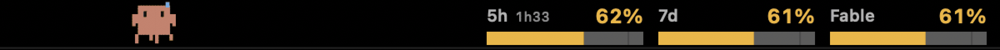

# claude-usage-touchbar

Your live Claude usage on the MacBook Pro Touch Bar, with a small pixel
creature pacing along beside it.



*Recorded with `make film-drag` — the widget's own animation loop, rendered
headless. No screen was filmed.*

The bars show the 5-hour and 7-day utilisation reported by Anthropic's own
usage endpoint — the same numbers `/usage` prints in Claude Code. Tick marks
sit at 50% and 90%. Colour and a `!` glyph both flag trouble, so the warning
survives a red/green colour deficiency. A per-model cap (currently Fable)
appears once it is actually being consumed.

The creature's behaviour is the gauge too: it strolls when you are under 30%,
picks up the pace past that, tires past 60%, and panics past 85%.

---

## Before you install: what this asks of your Mac

**It reads your Claude Code OAuth token from the login keychain.** That is the
only way to ask the usage endpoint who you are. Specifically:

- `~/bin/claude-touchbar.sh` calls `/usr/bin/security find-generic-password`
  on the item `Claude Code-credentials`, which Claude Code itself created.
- **On most machines this does not prompt**, because `/usr/bin/security` is
  already a trusted application on that keychain item. If yours does prompt,
  it will name `security` — not this project.
- The app binary never touches the keychain. It runs the script and draws
  whatever text comes back.

**It uses private AppKit/DFRFoundation API.** A Control Strip item is a fixed,
narrow slot; there is no public or private way to widen it. Anything that
wants real estate on the Touch Bar has to call
`+[NSTouchBar presentSystemModalTouchBar:placement:systemTrayItemIdentifier:]`.
Every Touch Bar utility does this — MTMR, Pock, BetterTouchTool. The practical
consequences: it can never ship on the App Store, and a future macOS could
break it (the app exits cleanly if the API disappears rather than crashing).

**It asks for no permissions to show you your usage** — no Full Disk Access, no
Screen Recording, nothing. One exception: the replacement Escape key posts a
synthetic key event through `CGEventPost`, which is what the Accessibility
permission governs. It has not prompted on the machine this was built on, but
if a dialog does appear it will be Accessibility, it will be the Escape button
that caused it, and declining costs you only that button.

See [SECURITY.md](SECURITY.md) for exactly where the token goes.

---

## Requirements

- MacBook Pro with a physical Touch Bar (2016–2023; the 13" M2 was the last)
- macOS 12+ — developed and tested on macOS 26.4
- Xcode Command Line Tools: `xcode-select --install`
- Claude Code, signed in (`claude` in a terminal)
- Node, **for the build only**: `brew install node`. It runs the pose data
  through its own engine once, at `make assets` time. Neither the widget nor
  the usage script uses it afterwards — those need nothing beyond what the
  Command Line Tools already installed.

## Install

```bash
git clone https://github.com/tpklo/claude-usage-touchbar
cd claude-usage-touchbar

make install-script    # puts the usage reader in ~/bin
make assets            # fetches Clawd's poses onto this machine
make run
```

Then set **System Settings → Keyboard → Touch Bar Settings → Touch Bar shows**
to *App Controls* if it is not already.

Check the script works on its own first:

```bash
~/bin/claude-touchbar.sh
# 5h 26%  7d 91%   reset 2h05
```

If it says `token expired`, run `claude -p hi` once — the CLI refreshes the
token for you. No re-login, no prompt.

### Why the poses are not in this repository

Clawd is Anthropic's mascot; the name and the character are theirs. The pose
library at [claudepix.vercel.app](https://claudepix.vercel.app) publishes no
licence, which means all rights reserved.

So the pose data is not redistributed here. `make assets` fetches the pose
grids at build time and writes them to `clawd_presets.h` on your machine.
Nothing you can build a pose library from is in this repository — the demo
recording at the top is a screenshot of the running widget, the same as any
project showing its own UI.

## Run it at login

```bash
make install-agent      # start at login, restart on crash
make uninstall-agent    # remove it again
```

The agent points at the bundle where you built it rather than copying it —
an ad-hoc signature does not survive a copy. Keep the checkout where it is, or
re-run `make install-agent` after moving it.

It restarts on a crash but not when you quit it yourself, and it does not load
outside a GUI session. Removing it leaves nothing behind: no daemon, no
preferences, no keychain entry of its own.

## How it fits together

```
~/bin/claude-touchbar.sh     keychain → API → cache → "5h 7d resetMin age state ..."
        ↑ NSTask every 30s
ClaudeTouchBar.app           draws the bars and the creature at 15fps
```

The split is deliberate: the GUI process holds no credentials and opens no
sockets, so the part with network and keychain access is 100 lines of shell
you can read in one sitting.

The script reports one of four states — `ok`, `stale`, `expired`, `none` — and
the widget renders each differently. An earlier version could not tell them
apart and happily displayed three-hour-old numbers as though they were live.

## Building

```bash
make            # build the .app
make assets     # re-fetch Clawd's poses
make test       # parser checks — no network, no keychain, no poses needed
make run        # build, restart, launch
make stop
make clean
```

The Touch Bar cannot be screenshotted, so several targets exist to look at work
that would otherwise be invisible:

```bash
make shots      # readout across eight data states -> PNGs
make poses      # all thirteen animation clips, mid-frame -> PNGs
make palette    # candidate colours side by side, on the bar itself
make ruler      # fixed ticks, to read the usable width off the bar
make sweat      # the drag reaction, held on screen
make film       # 20s of the real animation loop -> PNGs (+ gif if ffmpeg)
make film-drag  # scripted grab, drag and throw -> PNGs (+ gif)
```

`palette` and `ruler` matter more than they sound. Colours picked from a PNG
were rejected three times running before the same choice made on the panel
landed in one; and the bar's usable width came out as three different numbers
depending on how it was measured, with only the ruler telling the truth.

Single Objective-C file, no dependencies, no package manager. The script needs
only `/usr/bin/python3`, which ships with the Command Line Tools the build
already requires.

`make test` covers the JSON parser, which is where a silent failure would hide:
a wrong scale or a dropped field still prints something that reads like a valid
measurement. CI runs it on every push, along with a check that no
machine-specific path has crept into a tracked file — a hard-coded nvm path
shipped once and broke every clone but the author's.

## Credits

- **Clawd**, the mascot, and all its artwork — [Anthropic](https://anthropic.com)
- **Pose library** — [claudepix.vercel.app](https://claudepix.vercel.app)
- Touch Bar private API usage follows the pattern established by
  [MTMR](https://github.com/Toxblh/MTMR) and [Pock](https://github.com/pock/pock)

Not affiliated with or endorsed by Anthropic.

## Licence

MIT, covering the code in this repository only. It does not extend to Clawd,
to Anthropic's artwork, or to the pose data — none of which is included here.
